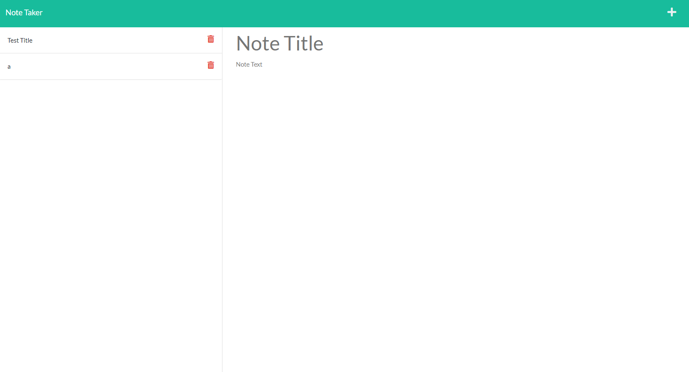

# Module-11 Challenge
# Note Taker

## Discription

This exercise is intended to be an intro into express.js.  We are using a mock database to store some notes.  We are using express.js to do get and post requests.  There is an extra credit delete request.

## Contributors

The CSS, HTML, and public javascript were provided by UNC bootcamp.  

## Technologies
* HTML
* CSS
* JavaScript
* Node.js
* Express.js

# Installation

You can do a git clone, or download the file.  You will need node installed.  With node installed you can go to the directory with the server.js in the command line.  Use <npm init -y> then <npm i express> to install Express.  To run the server use <npm start>

## Mock Up

When you type in a note, a save button will appear.  Clicking on the botton will move the note to the json.  Delete button doesn't work yet.  
